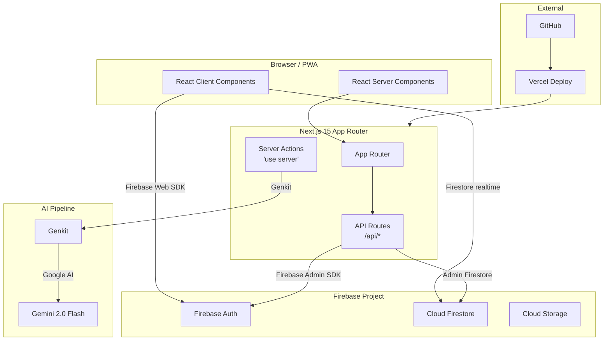
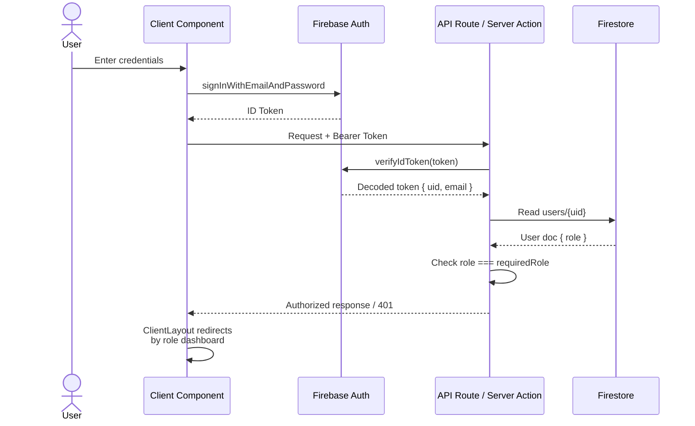
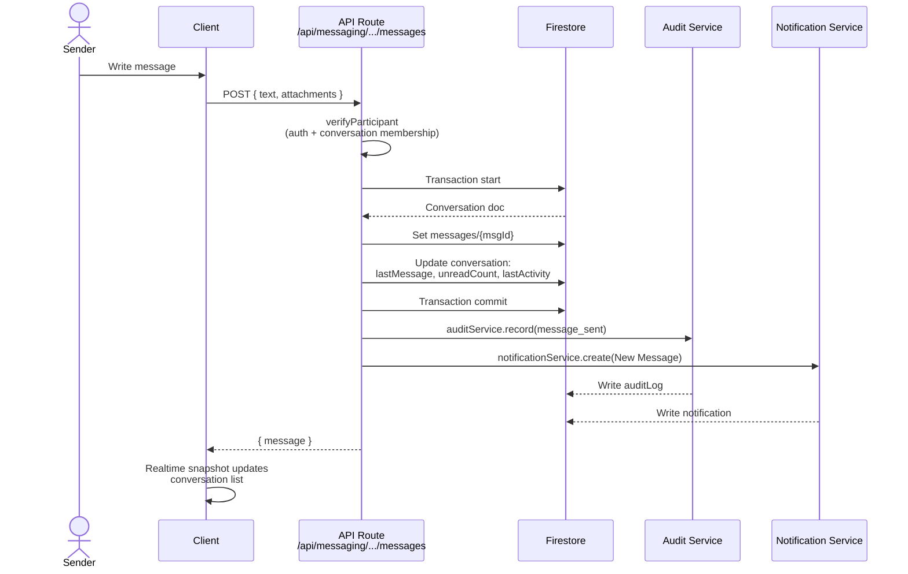
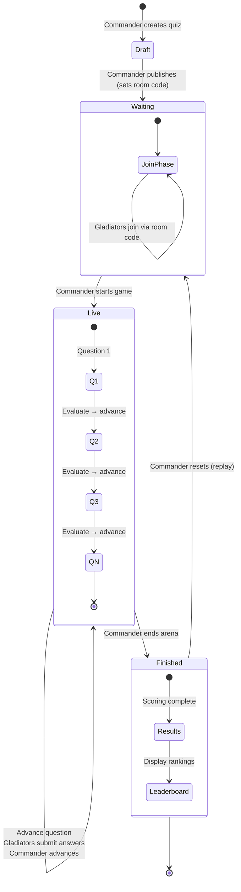
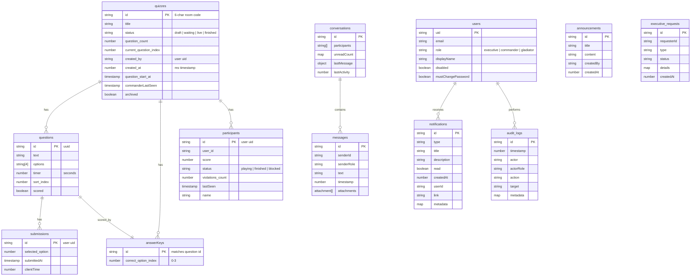
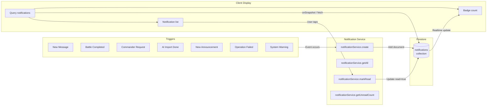

# Knowledge Arena — Architecture

## 1. System Architecture

High-level overview of the full stack. The Next.js App Router serves both the client UI (React Server/Client Components) and API Routes. Client components interact with Firebase Web SDK (Firestore, Auth) directly for real-time data. Admin-only operations go through API Routes which use the Firebase Admin SDK. Gemini AI is accessed via Genkit through a server action.



---

## 2. Authentication Flow

Login is handled client-side via Firebase Auth. The ID token is then verified server-side in API Routes and Server Actions using `verifyFirebaseToken` / `verifyFirebaseTokenWithRole`. The `ClientLayout` component enforces route-level redirection based on role and authentication state.



---

## 3. Role-Based Authorization

Three roles — **Executive** (admin/analytics), **Commander** (quiz creator/host), **Gladiator** (quiz participant). Enforcement happens at three layers: Client Layout route guards, API route token+role verification, and Firestore security rules.

```mermaid
graph TD
  subgraph Roles["Roles"]
    EX[Executive]
    CM[Commander]
    GL[Gladiator]
  end

  subgraph ClientLayer["Client Layout Guard"]
    CL[ClientLayout.tsx]
    CL -->|no user| R1[Redirect to /]
    CL -->|no role| R1
    CL -->|mustChangePassword| R2[Redirect to /force-password-change]
    CL -->|executive| D1[/executive/analytics]
    CL -->|commander| D2[/commander/dashboard]
    CL -->|gladiator| D3[/gladiator/dashboard]
  end

  subgraph APILayer["API Route Guard"]
    VF[verifyFirebaseTokenWithRole]
    VF -->|decode + check role| A1[Allow / 200]
    VF -->|fail| A2[401 Unauthorized]
  end

  subgraph FSRules["Firestore Security Rules"]
    SR[Security Rules]
    SR -->|executive| RW[Read/Write all]
    SR -->|commander| QW[Read/Write own quizzes]
    SR -->|gladiator| PR[Read/Write own participant data]
  end

  EX --> CL
  CM --> CL
  GL --> CL
  EX --> VF
  CM --> VF
  GL -.->|limited| VF
  EX --> SR
  CM --> SR
  GL --> SR
```

---

## 4. Messaging Architecture

Messages are exchanged between Executives and Commanders. Firestore transactions ensure atomicity when writing a message and updating the conversation's `lastMessage` and `unreadCount`. An audit log and notification are created after the transaction succeeds.



---

## 5. AI PDF Forge Pipeline

Executives and Commanders upload a PDF. The server action extracts text using `pdfreader`, sends it to Gemini (via Genkit with model fallback and retry logic), validates the structured output, and returns questions to be saved to Firestore.

```mermaid
flowchart TD
  U[User] -->|Upload PDF| FE[Client]
  FE -->|server action| SA[generateQuizFromPDF<br/>'use server']
  SA -->|1. Auth| VF[verifyFirebaseTokenWithRole<br/>executive | commander]
  VF -->|2. Rate Limit| RL[rateLimiter.check<br/>5 req/min]
  RL -->|3. Parse PDF| PR[PdfReader.parseBuffer]
  PR -->|4. Extract text| TX[Text extraction]
  TX -->|5. Build prompt| PM[Prompt with<br/>difficulty + questionCount]
  PM -->|6. Gemini call| GM[callGeminiWithFallback<br/>Retry up to 3x<br/>Model fallback chain]
  GM -->|7. Repair JSON| RJ[repairJson<br/>Fix markdown fences<br/>& single quotes]
  RJ -->|8. Parse output| PS[tryParseQuestions]
  PS -->|9. Return| SA
  SA -->|10. Save to Firestore| FS[(Firestore<br/>quizzes/{id}/questions)]
  SA -->|11. Return| FE
  FE -->|Display| U
```

---

## 6. Quiz / Arena Flow

A Commander creates a quiz (waiting state), publishes it, gladiators join with a room code, the Commander starts the game, questions advance one-by-one, gladiators submit answers (scored with time bonus), the Commander ends the arena, results are evaluated, and a leaderboard is displayed.



**Scoring formula**: For each correct answer, `score = 500 + 500 × max(0, 1 − elapsed / timeLimit)` — a time bonus up to 500 points.

---

## 7. Firestore Data Model

The primary collections and their subcollection hierarchy. All quiz-scoped data lives under `quizzes/{quizId}` subcollections.



---

## 8. Notification System

Events throughout the system (new message, battle completed, commander request, etc.) trigger notification creation via the admin SDK. Notifications are stored in a top-level `notifications` collection and queried client-side to display unread counts and badge indicators.



---

## 9. Deployment Architecture

The app is deployed on Vercel (serverless functions for API routes, edge-rendered pages). Firebase hosts Auth, Firestore, and optional Storage. Static analysis (lint + typecheck) runs pre-deploy. Genkit AI runs inline in serverless functions.

```mermaid
graph LR
  subgraph Source["Source Control"]
    GH[GitHub Repository]
  end

  subgraph CI["CI Pipeline"]
    LINT[npm run lint]
    TC[npm run typecheck]
    BUILD[npm run build]
  end

  subgraph Hosting["Vercel"]
    direction TB
    FE2[Next.js SSR/SSG]
    API2[Serverless Functions<br/>API Routes]
    SA2[Server Actions]
  end

  subgraph Firebase2["Firebase"]
    direction TB
    FA2[Firebase Auth]
    FS2[Cloud Firestore]
    ST2[Cloud Storage<br/>(optional)]
  end

  subgraph AI2["AI Services"]
    GK2[Genkit Plugin]
    GM2[Gemini 2.0 Flash<br/>(Google AI)]
  end

  GH -->|Push / PR| CI
  CI -->|Deploy| FE2
  CI -->|Deploy| API2
  FE2 -->|Client SDK| FA2
  FE2 -->|Client SDK| FS2
  API2 -->|Admin SDK| FA2
  API2 -->|Admin SDK| FS2
  SA2 --> GK2
  GK2 --> GM2
```

---

**Diagram count: 9** — System Architecture, Authentication Flow, Role-Based Authorization, Messaging Architecture, AI PDF Forge Pipeline, Quiz/Arena Flow, Firestore Data Model, Notification System, Deployment Architecture.
